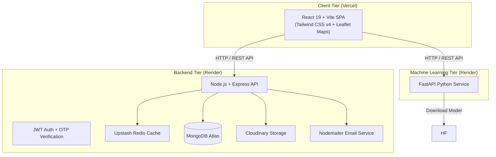

# 🏡 EstateLanka - Smart Real Estate Platform & Machine Learning Price Predictor

[](https://react.dev/)
[](https://vitejs.dev/)
[](https://tailwindcss.com/)
[](https://nodejs.org/)
[](https://www.mongodb.com/)
[](https://fastapi.tiangolo.com/)
[](https://upstash.com/)
[](https://vercel.com/)
[](https://render.com/)

**EstateLanka** is a full-stack real estate platform tailored for the Sri Lankan property market. It empowers buyers, property sellers/agents, and platform administrators with seamless property browsing, interactive map integrations, listing comparison, image management, inquiry messaging, and AI-powered house price predictions driven by a custom Scikit-Learn machine learning model hosted on Hugging Face.

---

## 📑 Table of Contents

- [Features](#-features)
- [Architecture & Tech Stack](#-architecture--tech-stack)
- [System Architecture Diagram](#-system-architecture-diagram)
- [Project Structure](#-project-structure)
- [Environment Variables](#-environment-variables)
- [Local Setup & Installation](#-local-setup--installation)
- [Running Unit & Integration Tests](#-running-unit--integration-tests)
- [Deployment Guide (Vercel & Render)](#-deployment-guide-vercel--render)
- [API Documentation](#-api-documentation)

---

## ✨ Features

### 👤 Buyer Experience
- **Interactive Property Search & Filters**: Search listings by location/district, property type (House, Land, Apartment, Commercial), price range, bedrooms, and bathrooms.
- **Interactive Map Integration**: View property locations on embedded Leaflet open-street maps.
- **Property Comparison Tool**: Compare up to 4 properties side-by-side on specs, pricing, and features.
- **Saved Favourites**: Authenticated buyers can save properties to their personal favorites list.
- **Inquiry Management**: Send direct inquiries to property sellers with automated email notifications.

### 🏢 Seller / Agent Portal
- **Dashboard Overview**: View listing analytics, inquiry totals, and recent customer messages.
- **Listing Management**: Add, update, or remove property listings with rich details (perches, sqft, parking spots, garden, AC, water supply, electricity, floors, year built).
- **Multi-Image Uploads**: Upload high-resolution property images powered by Cloudinary.
- **AI House Price Estimator**: Instant price estimation for Sri Lankan properties powered by our Machine Learning API.

### 🛡️ Admin Portal
- **System Dashboard**: Complete platform oversight including total users, active listings, and inquiries.
- **User Management**: Approve seller accounts, manage permissions, or toggle user access.
- **Listing Moderation**: Review, approve, or delete property listings across the platform.

### 🔒 Security & Performance
- **Authentication**: JWT access & refresh tokens with secure HTTP-only cookies and bcrypt password hashing.
- **OTP Email Verification**: Automated 6-digit OTP delivery for registration and password resets via Nodemailer.
- **Upstash Redis Caching**: Query caching and rate-limiting acceleration.
- **Rate Limiting**: Protection against brute-force attacks via `express-rate-limit`.

---

## 🛠️ Architecture & Tech Stack

| Tier | Technologies |
|---|---|
| **Frontend (`/client`)** | React 19, Vite, Tailwind CSS v4, React Router v7, Leaflet / React Leaflet, React Icons |
| **Backend (`/server`)** | Node.js, Express.js, MongoDB (Mongoose), JWT, BcryptJS, Cloudinary, Upstash Redis, Nodemailer |
| **Machine Learning (`/ml-api`)** | Python 3, FastAPI, Scikit-Learn, Pandas, Joblib, Uvicorn |
| **Testing** | Vitest, Supertest, MongoDB Memory Server |
| **Deployment** | Vercel (Frontend), Render (Node.js API & Python ML API) |

---

## 📐 System Architecture Diagram



---

## 📁 Project Structure

```
EstateLanka/
├── client/                     # Frontend React + Vite Application
│   ├── public/                 # Static assets
│   ├── src/
│   │   ├── assets/             # Images and design resources
│   │   ├── components/         # Reusable UI components (Navbar, Footer, PropertyCard, Maps)
│   │   ├── context/            # Global React Context (AuthContext)
│   │   ├── layouts/            # Page layouts (AdminLayout, SellerLayout)
│   │   ├── pages/              # App pages (Home, Properties, Compare, Admin, Seller, Buyer)
│   │   ├── routes/             # Protected and Role-based Route Guards
│   │   ├── services/           # Axios / Fetch API service calls
│   │   └── utils/              # Helper utilities and formatters
│   ├── package.json
│   └── vercel.json             # Vercel SPA Routing configuration
│
├── server/                     # Backend Express.js Server
│   ├── config/                 # DB, Cloudinary, Redis, Email configurations
│   ├── controllers/            # Route controllers (Auth, Property, User, Inquiry)
│   ├── middleware/             # Auth guards, Rate limiters, Upload middlewares
│   ├── models/                 # Mongoose Data Schemas (User, Property, Inquiry)
│   ├── routes/                 # Express API routes
│   ├── tests/                  # Integration and Unit Tests (Vitest)
│   ├── utils/                  # OTP generator, JWT tokens, Mailer templates
│   └── server.js               # Application entry point
│
├── ml-api/                     # Machine Learning FastAPI Service
│   ├── main.py                 # FastAPI endpoints & HuggingFace model loader
│   ├── model/                  # Downloaded Scikit-Learn PKL model directory
│   └── requirements.txt        # Python package dependencies
│
├── render.yaml                 # Infrastructure-as-Code blueprint for Render
└── README.md                   # Project documentation
```

---

## 🔑 Environment Variables

### 1. Client (`client/.env`)
```env
VITE_API_URL=http://localhost:5000/api
VITE_ML_API_URL=http://localhost:8000
```

### 2. Backend (`server/.env`)
```env
PORT=5000
MONGO_URI=mongodb+srv://<username>:<password>@cluster.mongodb.net/estatelanka?retryWrites=true&w=majority

JWT_ACCESS_SECRET=your_jwt_access_secret
JWT_REFRESH_SECRET=your_jwt_refresh_secret

ACCESS_TOKEN_EXPIRES_IN=15m
REFRESH_TOKEN_EXPIRES_IN=7d

EMAIL_USER=your_email@gmail.com
EMAIL_PASSWORD=your_app_specific_password

CLOUDINARY_CLOUD_NAME=your_cloudinary_cloud_name
CLOUDINARY_API_KEY=your_cloudinary_api_key
CLOUDINARY_API_SECRET=your_cloudinary_api_secret

FRONTEND_URL=http://localhost:5173
CLIENT_URL=http://localhost:5173

UPSTASH_REDIS_REST_URL=https://your-redis-instance.upstash.io
UPSTASH_REDIS_REST_TOKEN=your_upstash_redis_token
```

### 3. ML API (`ml-api/.env`)
```env
FRONTEND_URL=http://localhost:5173
```

---

## 🚀 Local Setup & Installation

### Prerequisites
- **Node.js**: v18.x or higher
- **Python**: v3.9 or higher
- **MongoDB**: Local instance or MongoDB Atlas cluster
- **Git**

### Step 1: Clone Repository
```bash
git clone https://github.com/HasarangaSam/LankaEstate.git
cd LankaEstate
```

### Step 2: Set Up Backend Server
```bash
cd server
npm install
cp .env.example .env # Update with your credentials
npm run dev
```
The server will run on `http://localhost:5000`.

### Step 3: Set Up Machine Learning API
```bash
cd ../ml-api
python -m venv venv
# On Windows:
venv\Scripts\activate
# On macOS/Linux:
source venv/bin/activate

pip install -r requirements.txt
uvicorn main:app --reload --port 8000
```
The ML service will run on `http://localhost:8000`. It will automatically fetch the model file from Hugging Face on first startup.

### Step 4: Set Up Client Application
```bash
cd ../client
npm install
npm run dev
```
Open `http://localhost:5173` in your browser.

---

## 🧪 Running Unit & Integration Tests

Backend tests are powered by **Vitest** with **MongoDB Memory Server**.

```bash
cd server
npm test
```

---

## ☁️ Deployment Guide (Vercel & Render)

### 1. Deploy Frontend on Vercel
1. Push your repository to GitHub.
2. Sign in to [Vercel](https://vercel.com/) and click **Add New Project**.
3. Import your GitHub repository (`LankaEstate`).
4. Set the **Root Directory** to `client`.
5. Set Build & Output Settings:
   - Framework Preset: **Vite**
   - Build Command: `npm run build`
   - Output Directory: `dist`
6. Add Environment Variables:
   - `VITE_API_URL`: Your deployed Render backend URL (e.g. `https://estatelanka-backend.onrender.com/api`)
   - `VITE_ML_API_URL`: Your deployed Render ML API URL (e.g. `https://estatelanka-ml-api.onrender.com`)
7. Click **Deploy**.

---

### 2. Deploy Backend & ML API on Render

You can deploy using Render's Infrastructure-as-Code (`render.yaml`) or manually:

#### Method A: Using Render Blueprint (`render.yaml`)
1. Sign in to [Render](https://render.com/).
2. Click **New +** -> **Blueprint**.
3. Connect your `LankaEstate` repository.
4. Render will automatically detect the services configured in `render.yaml`.
5. Fill in the required secret environment variables (`MONGO_URI`, `EMAIL_USER`, `EMAIL_PASSWORD`, `CLOUDINARY_*`, `UPSTASH_*`, `FRONTEND_URL`).
6. Click **Apply**.

#### Method B: Manual Web Services Setup

**Backend Node Server:**
- **Environment**: Node
- **Root Directory**: `server`
- **Build Command**: `npm install`
- **Start Command**: `npm start`
- Add all required `server/.env` variables into Render's Environment tab.

**Python ML API:**
- **Environment**: Python
- **Root Directory**: `ml-api`
- **Build Command**: `pip install -r requirements.txt`
- **Start Command**: `uvicorn main:app --host 0.0.0.0 --port $PORT`
- Add `FRONTEND_URL` to Render Environment tab.

---

## 📡 API Documentation Summary

### Auth Routes (`/api/auth`)
- `POST /api/auth/register` - Register a new user & send OTP.
- `POST /api/auth/verify-otp` - Verify account OTP.
- `POST /api/auth/login` - User authentication & JWT issuance.
- `POST /api/auth/forgot-password` - Request password reset OTP.
- `POST /api/auth/reset-password` - Reset password with OTP.
- `POST /api/auth/logout` - Clear auth tokens.

### Property Routes (`/api/properties`)
- `GET /api/properties` - List properties with filtering & pagination.
- `GET /api/properties/:id` - Fetch detailed single property view.
- `POST /api/properties` - Add new property (Seller/Admin).
- `PUT /api/properties/:id` - Update existing property listing.
- `DELETE /api/properties/:id` - Delete property listing.

### ML API Routes (`http://localhost:8000`)
- `GET /` - Health check status.
- `POST /predict` - Accepts property parameters and returns estimated property price in LKR.

---

## 📄 License & Contact

Distributed under the **ISC License**. Created by [HasarangaSam](https://github.com/HasarangaSam).
For support or inquiries, please contact the developer via GitHub.
